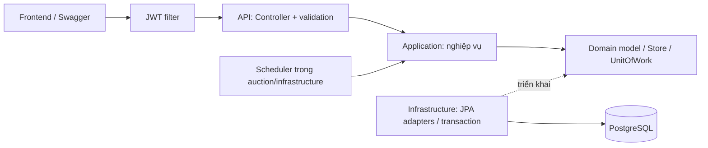

# KTPM — Hệ thống đấu giá tay

Dự án Pha 1 xây dựng dịch vụ đấu giá bằng REST API/JSON, có frontend, xác thực, phân tầng nghiệp vụ, PostgreSQL, đóng gói Docker và bộ chạy kiểm thử tải trên Kaggle CPU.

## 1. Các tính năng chính

### Tài khoản và vai trò

- Đăng ký tài khoản USER; đăng nhập bằng tên tài khoản hoặc email; đăng xuất.
- Người dùng có thể tạo phiên và tham gia đặt giá ở các phiên của người khác.
- ADMIN xem danh sách tài khoản/phiên và xóa dữ liệu thử. Không tự xóa tài khoản admin đang đăng nhập.

### Phiên đấu giá và đặt giá

Mỗi phiên chứa tên món hàng, mô tả, tình trạng, một URL ảnh tùy chọn, giá khởi điểm, bước giá, thời gian bắt đầu/kết thúc. Không cần tạo product hay danh mục riêng.

Luồng chính: tạo phiên → mở phiên → người dùng đặt giá tay → hết giờ → xác định kết quả.

| Trạng thái | Ý nghĩa |
|---|---|
| SCHEDULED | Chưa đến thời gian bắt đầu |
| ACTIVE | Đang nhận bid |
| ENDED | Đã kết thúc, có người thắng |
| FAILED | Đã kết thúc, không có bid còn lại |

Lượt bid đầu được bằng giá khởi điểm. Các lượt tiếp theo phải ít nhất bằng giá hiện tại cộng bước giá. Người bán không bid vào phiên của mình; người đang dẫn đầu không đặt tiếp. Phiên chưa mở hoặc đã hết giờ không nhận bid. Có thể xem chi tiết phiên, lịch sử giá, phiên của mình và các bid của mình.

Scheduler quét các phiên đến hạn, xử lý tuần tự và chờ 5 giây sau mỗi lượt. Khi khởi động, scheduler xử lý lại các phiên quá hạn. API bid kiểm tra thời gian thực tế nên không nhận bid sau giờ kết thúc, kể cả scheduler chưa cập nhật trạng thái.

Giao diện cập nhật sau thao tác và khi bấm **Làm mới/F5**; không có realtime hay polling. Đồng hồ frontend chỉ hiển thị thời gian, backend quyết định việc chấp nhận bid.

### Xóa dữ liệu

Người bán chỉ xóa phiên của mình khi chưa có bid. Admin được xóa cả phiên đã có bid; lịch sử bid của phiên cũng bị xóa. Khi admin xóa tài khoản, hệ thống xóa các phiên người đó tạo, bid liên quan và bid của họ ở phiên khác; đồng thời tính lại giá/người dẫn đầu/người thắng từ bid còn lại, kể cả phiên đã kết thúc. Đây là xóa hẳn.

Phạm vi hiện tại không có ví, nạp tiền, thanh toán, auto-bid, giá dự trữ, quản lý product/category, sửa hồ sơ hay khóa/cấm tài khoản. Bid không phụ thuộc số dư ví.

## 2. Kiến trúc hệ thống

### Công nghệ

| Thành phần | Công nghệ |
|---|---|
| Backend | Java 17+, Spring Boot 3.2.3, Maven |
| API | Spring MVC, JSON, Bean Validation, Springdoc OpenAPI/Swagger |
| Xác thực | Spring Security, JWT, BCrypt |
| Truy cập dữ liệu | Spring Data JPA/Hibernate, PostgreSQL 16.2, Flyway |
| Frontend | React 18, TypeScript, Vite, React Router, TanStack Query |
| Số tiền trên frontend | decimal.js, lossless-json |
| Kiểm thử | JUnit, Spring Boot Test, PostgreSQL thật, Vitest, Playwright |
| Đóng gói | Docker Compose, Nginx phục vụ frontend |
| Kiểm thử tải | Python, psutil, Kaggle CPU |

### Phân tầng



| Tầng | Trách nhiệm |
|---|---|
| API | Nhận JSON, kiểm tra đầu vào, lấy người đang đăng nhập, gọi service và trả HTTP response |
| Application | Thực hiện đăng nhập, tạo phiên, đặt giá, kết thúc phiên, xóa dữ liệu qua các interface |
| Domain | Model nghiệp vụ, luật đấu giá và interface truy cập dữ liệu |
| Infrastructure | Ánh xạ model/entity ORM, query/lock PostgreSQL, transaction, JWT/filter và callback scheduler |

Application/domain không import Spring, HTTP/servlet, JPA/JDBC hoặc lớp API/infrastructure. Lombok chỉ sinh mã khi biên dịch. Repository được sử dụng qua interface `UserStore`, `AuctionStore`, `BidStore`; adapter JPA nằm bên dưới. `UnitOfWork` là interface transaction, triển khai bằng `SpringUnitOfWork`. Cấu hình Spring nối các service thuần Java với adapter.

Thao tác bid khóa hàng phiên và ghi bid/giá trong cùng transaction. Nếu ghi thất bại, toàn bộ thao tác rollback. Admin dọn dữ liệu sử dụng khóa bảo trì PostgreSQL để phối hợp với các thao tác ghi thông thường. Scheduler thuộc module auction; security thuộc module auth, đặt ở infrastructure vì phụ thuộc framework.

### Tổ chức thư mục

```text
KTPM/
├── backend/
│   ├── src/main/java/com/ktpm/
│   │   ├── auth/       Đăng ký, đăng nhập, logout và bảo mật
│   │   ├── user/       Tài khoản và repository
│   │   ├── auction/    Phiên, món hàng và scheduler
│   │   ├── bidding/    Bid tay và lịch sử
│   │   ├── admin/      Xóa dữ liệu thử
│   │   └── common/     Lỗi, phân trang, model chung và cấu hình
│   ├── src/main/resources/db/migration/
│   ├── src/test/
│   └── pom.xml
├── frontend/           Source giao diện, Dockerfile, Nginx, unit test/E2E
├── scripts/            Launcher, test, demo, benchmark
├── docs/               Đặc tả API và hướng dẫn Kaggle
├── notebooks/          Notebook Kaggle CPU
├── Dockerfile          Đóng gói backend
├── docker-compose.yml  Chạy cả ba service
└── README.md
```

### Database

| Bảng | Dữ liệu |
|---|---|
| users | Tài khoản, hash mật khẩu, quyền và phiên bản thu hồi token |
| auctions | Thông tin món hàng/ảnh, người bán, giá, thời gian, trạng thái và kết quả |
| bids | Người đặt giá, phiên, số tiền, trạng thái và timestamp |
| flyway_schema_history | Bảng kỹ thuật ghi lịch sử migration |

Flyway tạo schema, Hibernate kiểm tra schema khi khởi động. Không dùng H2. Swagger là công cụ gọi API, không có database riêng.

## 3. Đặc tả API

- [Swagger khi backend đang chạy](http://localhost:8080/swagger-ui/index.html)
- [OpenAPI JSON](http://localhost:8080/v3/api-docs)
- [Đặc tả và ví dụ JSON chi tiết](docs/API.md)

Base URL: `http://localhost:8080`. API có body dùng JSON; DELETE thành công trả 204 không body. Qua frontend Docker, có thể gọi `/api/...` tại `http://localhost:5173` nhờ Nginx proxy.

| Method | Endpoint | Yêu cầu xác thực/quyền | Chức năng |
|---|---|---|---|
| POST | /api/auth/register | Không | Đăng ký USER |
| POST | /api/auth/login | Không | Đăng nhập, cấp JWT |
| POST | /api/auth/logout | Có | Thu hồi token của tài khoản |
| GET | /api/auth/me | Có | Lấy danh tính/quyền người đăng nhập |
| GET | /api/auctions | Không | Danh sách, tìm kiếm, lọc phiên |
| POST | /api/auctions | Có | Tạo phiên kèm thông tin món hàng |
| GET | /api/auctions/me | Có | Danh sách phiên mình tạo |
| GET | /api/auctions/{id} | Không | Chi tiết phiên |
| DELETE | /api/auctions/{id} | Có; chủ phiên, chưa có bid | Xóa phiên của mình |
| POST | /api/auctions/{id}/bids | Có; đáp ứng luật bid | Đặt giá tay |
| GET | /api/auctions/{id}/bids | Không | Lịch sử bid của phiên |
| GET | /api/users/me/bids | Có | Bid của mình |
| GET | /api/admin/users | ADMIN | Danh sách tài khoản |
| DELETE | /api/admin/users/{id} | ADMIN | Xóa tài khoản và tính lại dữ liệu liên quan |
| GET | /api/admin/auctions | ADMIN | Danh sách phiên để quản trị |
| DELETE | /api/admin/auctions/{id} | ADMIN | Xóa phiên và tất cả bid |

Danh sách nhận `page` từ 0, `size` mặc định 20, tối đa 100; trả `content`, `page`, `size`, `totalElements`, `totalPages`. Danh sách phiên còn nhận `status` và `search` theo tên món hàng.

Ví dụ login:

```json
{"login":"seller","password":"Seller123!"}
```

Response chứa `accessToken`, `tokenType`, `expiresIn`. Với Swagger, sao chép **accessToken**, bấm **Authorize** và nhập token. Với client khác, gửi header:

```http
Authorization: Bearer <accessToken>
Content-Type: application/json
```

| Mã HTTP | Ý nghĩa thường gặp |
|---|---|
| 200 / 201 / 204 | Đọc/đăng nhập thành công, tạo thành công, xóa/logout thành công |
| 400 | JSON, trường dữ liệu hoặc phân trang không hợp lệ |
| 401 | Chưa xác thực, token hết hạn hoặc bị thu hồi |
| 403 | Sai quyền hoặc thao tác không được phép |
| 404 | Không tìm thấy đối tượng |
| 409 | Trùng tài khoản, xung đột giá/trạng thái hoặc dữ liệu |
| 500 | Lỗi ngoài dự kiến |

Lỗi JSON có `timestamp`, `status`, `error`, `message`, `path`. Schema request/response cụ thể xem OpenAPI sinh từ code.

## 4. Cơ chế bảo mật và xác thực

Mật khẩu lưu bằng BCrypt, không lưu dạng rõ. JWT ký bằng secret cấu hình từ `JWT_SECRET`, có issuer KTPM, user ID, quyền, tokenVersion và thời hạn. Mặc định token có hiệu lực 3.600 giây; có thể cấu hình `JWT_TTL_SECONDS`.

`JwtAuthenticationFilter` kiểm tra chữ ký, issuer, hạn token và tài khoản/tokenVersion hiện tại trước controller. Chính sách endpoint tập trung trong Spring Security; admin cần role ADMIN. Không lặp kiểm tra token trong từng endpoint. Backend không dùng HTTP session; frontend giữ token trong `sessionStorage`, nên các tab có thể đăng nhập các tài khoản riêng.

Logout tăng tokenVersion, thu hồi toàn bộ JWT đã cấp trước đó của cùng tài khoản, kể cả token trên tab khác. Xóa tài khoản khiến token không còn sử dụng được. Đăng ký công khai luôn cấp quyền USER.

Secret JWT tối thiểu 32 byte. Secret và tài khoản seed mặc định chỉ phục vụ demo. Khi triển khai ngoài môi trường demo cần dùng secret riêng và tắt profile dev/seed. Cấu hình CORS qua `CORS_ORIGINS`; Docker frontend gọi API cùng origin qua Nginx. Không đưa secret vào biến frontend `VITE_*` hoặc commit `.env`/fixture token.

## 5. Hướng dẫn triển khai và khởi chạy

**Người mới:** xem [hướng dẫn ngắn tải và chạy trên Windows](docs/CAI_DAT_VA_CHAY.md), gồm cách Docker và chạy trực tiếp.

### 5.1. Chạy toàn bộ bằng Docker

Cần Git để clone và Docker Desktop đang chạy với **Linux containers**. Cần Internet trong lần build đầu để tải image/dependency. Máy chạy bản Docker không cần cài riêng Java, Maven, Node.js hoặc PostgreSQL.

```powershell
git clone https://github.com/Loistarva/KTPM.git
cd KTPM
Copy-Item .env.example .env
docker compose up --build -d
docker compose ps
```

Lệnh clone lấy bản đã push lên GitHub. Nếu thay đổi mới chỉ ở máy hiện tại, dùng thư mục hiện tại hoặc chuyển source đầy đủ; clone chưa có các thay đổi chưa push. Tại máy hiện tại:

```powershell
cd "C:\Users\LENOVO\Desktop\auction system\KTPM"
docker compose up --build -d
```

Chỉ tạo `.env` nếu chưa có; giữ cấu hình cá nhân hiện có. Dừng launcher portable và Vite nếu đang chạy để tránh trùng cổng.

| Địa chỉ mặc định | Mục đích |
|---|---|
| http://localhost:5173 | Giao diện |
| http://localhost:8080/swagger-ui/index.html | Thử API bằng Swagger |
| http://localhost:8080/actuator/health | Kiểm tra backend sẵn sàng |
| localhost:5432 | PostgreSQL Docker |

Compose bật PostgreSQL, backend và frontend Nginx. Frontend được build bằng Node, image chạy cuối chỉ phục vụ file tĩnh qua Nginx; `/api/` chuyển tới `backend:8080`. Nginx hỗ trợ mở trực tiếp các trang như `/login`, `/auctions/123`.

Đổi cổng qua `FRONTEND_PORT`, `PORT`, `DB_PORT` trong `.env`. Xem log và dừng:

```powershell
docker compose logs --tail=100 frontend backend postgres
docker compose down
```

`down` giữ dữ liệu trong volume `ktpm_simple_postgres_data`; chạy `up` lại dùng dữ liệu đó. **`docker compose down -v` xóa database Docker.** Database Docker độc lập với database portable. Dự án dùng một Compose ở gốc để chạy toàn bộ hệ thống.

### 5.2. Chạy source trên Windows không dùng Docker

Cần JDK 17+ (đã kiểm thử với JDK 21), Node.js 22 từ 22.17 hoặc phiên bản tương thích trong `frontend/package.json`. Maven wrapper có sẵn; lần đầu cần Internet tải dependency.

Terminal 1, tại gốc dự án:

```powershell
powershell -ExecutionPolicy Bypass -File scripts/start-portable.ps1
```

Lệnh bật PostgreSQL portable thật ở cổng 55432 và backend ở 8080. Giữ terminal mở; Ctrl+C dừng. Dữ liệu lưu tại `backend/.local/postgres`, chạy lại giữ lịch sử. Không bật hai launcher hoặc backend Docker cùng cổng 8080.

Terminal 2:

```powershell
cd frontend
npm.cmd ci
npm.cmd run dev
```

Mở http://localhost:5173. Frontend Vite chuyển API tới backend trên host. Docker và portable là hai cách chạy thay thế nhau, không cần bật cả hai.

### 5.3. Tài khoản demo và xem database

Tài khoản seed có khi bật profile dev (mặc định Compose/launcher demo):

| Username | Password | Quyền |
|---|---|---|
| admin | Admin123! | ADMIN |
| seller | Seller123! | USER |
| bidder1 | Bidder123! | USER |
| bidder2 | Bidder123! | USER |

Cũng có thể đăng ký tài khoản mới. Để xem database bằng DBeaver, chọn kết nối PostgreSQL:

Khi thử trường ảnh, có thể dùng URL mẫu `http://localhost:5173/demo-product.svg` (đổi cổng nếu cần). Đây là ảnh tĩnh cho thử nghiệm, không phải module quản lý product.

| Thuộc tính | Docker mặc định | Portable |
|---|---|---|
| Host | localhost | localhost |
| Port | 5432 | 55432 |
| Database | ktpm | postgres |
| Username | ktpm | postgres |
| Password | ktpm_dev | Để trống |

Database tương ứng phải đang chạy. Với Docker, giá trị thực tế lấy từ `.env` nếu đã đổi. Dữ liệu của hai cách chạy không tự đồng bộ. Frontend dùng database của backend mà nó đang gọi.

### 5.4. Xử lý lỗi thường gặp

- Không nhận lệnh `docker`: kiểm tra cài đặt Docker và mở lại terminal.
- Không kết nối Docker engine: mở Docker Desktop và đợi engine chạy.
- Cổng bị chiếm: dừng bản chạy cũ hoặc đổi cổng `.env`.
- Frontend không gọi được API: kiểm tra health/backend và log Nginx/backend.
- 401: đăng nhập lại; 403: kiểm tra quyền; 409 khi bid: làm mới giá/trạng thái.
- Lỗi tải dependency: kiểm tra Internet; không xóa database để xử lý.

## 6. Kiểm thử chức năng

### 6.1. Backend

Tại gốc dự án, chạy test với PostgreSQL portable riêng:

```powershell
powershell -ExecutionPolicy Bypass -File scripts/test.ps1 -PortablePostgres
```

Hoặc bỏ `-PortablePostgres` để dùng Testcontainers khi Docker đang chạy. Dừng backend portable trước lệnh clean/build để tránh khóa file. Database test riêng, không dùng database demo. Báo cáo ở `backend/target/surefire-reports/`.

Các test kiểm tra luật bid, đầu vào/API, xác thực/phân quyền, cạnh tranh bid/xóa/kết thúc, rollback khi ghi thất bại và ranh giới phân tầng.

### 6.2. Frontend và trình duyệt

Tại thư mục frontend (máy chạy test cần Node.js):

```powershell
npm.cmd ci
npm.cmd test
npm.cmd run format:check
npm.cmd run build
npx.cmd playwright install chromium
```

Với cả hệ thống Docker đang bật, chạy E2E qua Nginx:

```powershell
$env:E2E_FRONTEND_URL="http://localhost:5173"
$env:E2E_API_URL="http://localhost:5173"
npm.cmd run test:e2e
Remove-Item Env:E2E_FRONTEND_URL,Env:E2E_API_URL
```

Với backend portable đang bật và không đặt hai biến E2E trên, chạy `npm.cmd run test:e2e`; Playwright bật/tái sử dụng Vite. E2E cần tài khoản admin seed, tạo dữ liệu thử và có thể để lại; chỉ chạy trên môi trường demo/test. Báo cáo: `frontend/playwright-report/index.html`, `frontend/test-results/results.json`.

Tám kịch bản bao gồm đăng ký/tạo phiên/bid/kết quả, làm mới thủ công và xung đột, admin xóa user/phiên, quyền xóa của seller, phiên không bid, độ chính xác tiền/double-click, tìm kiếm/phân trang và giao diện mobile responsive.

### 6.3. Demo

Backend đang chạy thì có thể thử luồng kết thúc phiên tự động:

```powershell
powershell -ExecutionPolicy Bypass -File scripts/demo.ps1 -DurationSeconds 20 -WaitForEnd
```

### 6.4. Kết quả đã kiểm chứng

| Kiểm tra | Kết quả lần kiểm tra 05/10/2026 |
|---|---|
| Backend | 29 test đạt; đóng gói JAR thành công |
| Frontend | 29 test đạt; build production và format check đạt |
| E2E Docker qua Nginx | 8 kịch bản đạt trên database thử riêng |
| Bộ tính số đo benchmark | 4 test đạt |
| Smoke tải local | Read/bid/mixed và CPU/RAM chạy được; không có lỗi ngoài dự kiến |

Đây là kết quả chức năng/smoke local, không thay cho phép đo tải đầy đủ trên Kaggle.

## 7. Phương pháp kiểm thử tải trên Kaggle CPU

- [Hướng dẫn đầy đủ](docs/KAGGLE_CPU.md)
- [Notebook để import vào Kaggle](notebooks/KTPM_Pha1_CPU.ipynb)
- Runner: `scripts/benchmark.py`; kiểm tra bộ tính số đo: `python scripts/test_benchmark.py`.

### Chuẩn bị và chạy

Tại gốc dự án, xuất source (không cần commit trước):

```powershell
powershell -ExecutionPolicy Bypass -File scripts/export-kaggle.ps1
```

ZIP ở `backend/.local/kaggle/ktpm-p1-source.zip`, chỉ chứa source backend/Maven wrapper và runner, không chứa database, token, `.env` hay cache. Nếu đã có ZIP cũ, xóa đúng ZIP đó hoặc chọn `-OutputPath` khác trước khi xuất lại.

Trên Kaggle: tạo dataset chứa ZIP → tạo/import notebook trên → Add Input dataset → chọn **Accelerator: None**, bật **Internet** → chạy các cell. Backend, PostgreSQL và client tải đều chạy trên cùng máy Kaggle CPU; không gọi backend trên laptop. Không cần frontend hoặc Docker trong notebook.

Chạy `SMOKE = True` trước để kiểm tra pipeline, rồi đổi `SMOKE = False` và chạy lại các cell cấu hình/môi trường/hàm trial/đo để lấy kết quả chính thức.

### Thiết kế phép đo

| Thông số | Giá trị mặc định của phép đo đầy đủ |
|---|---|
| Mode | read, bid, mixed |
| Concurrency | 1, 10, 50 |
| Số lần lặp | 3 cho mỗi mode/concurrency, tổng 27 trial |
| Request đo | 1.000 mỗi trial |
| Warmup | 100 request mỗi trial, concurrency 1 |
| Dữ liệu | Database mới mỗi trial, 25 bidder, một phiên ACTIVE |
| Seed | 42 |
| JVM | -Xms256m -Xmx512m -XX:ActiveProcessorCount=2 |
| Database | PostgreSQL 16.2 |

Read luân phiên danh sách/chi tiết/lịch sử. Bid tạo tranh chấp trên một phiên. Mixed sinh 70% list, 15% detail, 15% bid theo seed (tỷ lệ thực tế phụ thuộc mẫu). Setup/build/warmup không tính vào thời gian đo. HTTP 409 khi thứ tự bid đến server đảo là xung đột nghiệp vụ hợp lệ, báo riêng với lỗi ngoài dự kiến.

### Chỉ số và kết quả

Ghi tổng RPS, **RPS thành công 2xx**, latency trung bình/p95/p99 cho toàn bộ request và request thành công, histogram HTTP, tỷ lệ 409, lỗi ngoài dự kiến, lỗi xác thực, CPU và peak RSS. CPU/RSS đo cây tiến trình backend/PostgreSQL bằng psutil; client vẫn cạnh tranh cùng phần cứng. RSS có thể đếm trùng shared pages; lấy mẫu có thể bỏ lỡ tiến trình ngắn. Không suy ra CPU hoặc bottleneck query từ latency HTTP.

Lưu CPU/RAM/affinity, phiên bản phần mềm, cấu hình JVM, workload và SHA256 source/runner trong `environment.json`. Báo cáo từng trial là JSON, mẫu request là JSONL, bảng tổng hợp là CSV. Tổng hợp median qua các trial; median p95 từng trial không phải p95 gộp. Thiếu request thành công thì latency tương ứng là null.

Tải `/kaggle/working/ktpm-benchmark/results-p1.zip`; kết quả smoke là `results-smoke.zip`. ZIP kết quả không chứa fixture token. Giữ source, notebook, cấu hình và báo cáo để phép đo có thể được đối chiếu trên cùng phần cứng.

**Trạng thái: đã chuẩn bị và kiểm tra cú pháp notebook/bộ chạy, chưa có kết quả đo tải đầy đủ thực hiện trên Kaggle.** Khi chạy xong, bổ sung cấu hình phần cứng thực tế và bảng số đo từ báo cáo vào tài liệu; không dùng smoke local làm kết quả Kaggle.
