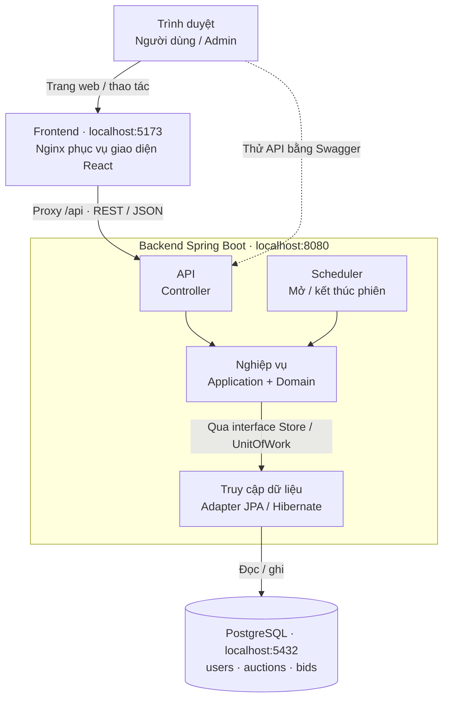

# KTPM — Hệ thống đấu giá cơ bản

Dự án đấu giá cơ bản cho Pha 1: backend REST API/JSON, frontend React, PostgreSQL và Docker. Pha 2 dùng cùng bộ kiểm thử tải để đánh giá các cải tiến kiến trúc.

## 1. Các tính năng chính

- Đăng ký, đăng nhập và đăng xuất; hai quyền USER/ADMIN.
- Tạo phiên kèm thông tin món hàng, một URL ảnh tùy chọn, giá khởi điểm, bước giá và thời gian.
- Đặt giá tay, xem phiên/lịch sử bid và hoạt động của mình.
- Scheduler mở/kết thúc phiên; có bid thì xác định người thắng, không có bid thì FAILED.
- Người bán xóa phiên chưa có bid; admin xóa hẳn tài khoản/phiên và tính lại kết quả liên quan.

Bid đầu ít nhất bằng giá khởi điểm; bid sau ít nhất bằng giá hiện tại cộng bước giá. Không bid phiên của mình, khi đang dẫn đầu hoặc ngoài thời gian đấu giá. Giao diện cập nhật bằng thao tác/Làm mới/F5; không có realtime, polling, ví, thanh toán hay auto-bid.

## 2. Kiến trúc hệ thống

### Kiến trúc tổng quan



Sơ đồ mô tả cách chạy Docker với cổng mặc định. React chạy trong trình duyệt; Nginx phục vụ giao diện và proxy `/api`. Spring Security/JWT filter xử lý xác thực trước controller.

[Xem giải thích kiến trúc](docs/KIEN_TRUC.md)

**Backend:** Java 17+, Spring Boot, Spring Security, JPA/Hibernate, PostgreSQL 16.2, Flyway, OpenAPI. **Frontend:** React, TypeScript, Vite, React Router, TanStack Query; decimal.js/lossless-json xử lý số tiền. **Docker:** Nginx/frontend, backend và PostgreSQL.

| Tầng | Trách nhiệm |
|---|---|
| API | Nhận/kiểm tra JSON, gọi service và trả HTTP |
| Application | Xử lý nghiệp vụ qua các interface |
| Domain | Model, luật nghiệp vụ và interface repository |
| Infrastructure | JPA, transaction, JWT/filter và scheduler |

Application/domain không import framework web hoặc thư viện DB. Adapter JPA triển khai repository; UnitOfWork giữ transaction. Bid khóa hàng phiên để ghi giá/lịch sử nhất quán. Scheduler thuộc auction, security thuộc auth.

### Cấu trúc mã nguồn

```text
KTPM/
├── backend/
│   ├── src/main/java/com/ktpm/
│   │   ├── KtpmApplication.java   # Điểm khởi động backend
│   │   ├── auth/                 # Đăng nhập, JWT và security
│   │   ├── user/                 # Tài khoản
│   │   ├── auction/              # Phiên, luật đấu giá và scheduler
│   │   ├── bidding/              # Bid và lịch sử
│   │   ├── admin/                # Quản lý/xóa dữ liệu
│   │   └── common/               # Thành phần dùng chung
│   ├── src/main/resources/
│   │   ├── application.yml       # Cấu hình backend
│   │   ├── application-dev.yml   # Cấu hình phát triển
│   │   └── db/migration/         # Schema PostgreSQL qua Flyway
│   ├── src/test/java/com/ktpm/    # Test và launcher LocalDemo
│   ├── pom.xml                   # Dependency và build Maven
│   └── .mvn/, mvnw, mvnw.cmd     # Maven wrapper
├── frontend/
│   ├── src/
│   │   ├── main.tsx, App.tsx     # Khởi tạo React và route
│   │   ├── pages/               # Các màn hình
│   │   ├── lib/                 # API client, query và xử lý tiền
│   │   ├── context.tsx          # Tài khoản và thông báo
│   │   ├── components.tsx       # Thành phần giao diện dùng chung
│   │   ├── types.ts             # Kiểu dữ liệu API
│   │   └── styles.css           # Giao diện
│   ├── tests/, e2e/             # Unit test và Playwright
│   ├── public/                  # Tài nguyên tĩnh
│   ├── package.json             # Dependency và lệnh npm
│   ├── Dockerfile               # Build và phục vụ frontend
│   └── nginx.conf.template      # Proxy API và route SPA
├── scripts/                     # Chạy dự án, đóng gói và benchmark
├── notebooks/                   # Notebook Kaggle P1/P2
├── docs/                        # Tài liệu kỹ thuật
├── reports/                     # Báo cáo và số liệu tổng hợp
├── Dockerfile                   # Đóng gói backend
├── docker-compose.yml           # Frontend + backend + PostgreSQL
├── .env.example                 # Mẫu cấu hình môi trường
└── README.md
```

Backend tổ chức theo module nghiệp vụ; bên trong dùng `api`, `application`, `domain`, `infrastructure` theo nhu cầu. Chi tiết nằm trong [kiến trúc backend](docs/KIEN_TRUC_BACKEND.md) và [kiến trúc frontend](docs/KIEN_TRUC_FRONTEND.md).

Database gồm `users`, `auctions`, `bids`; `flyway_schema_history` là bảng kỹ thuật. Không dùng H2; Swagger không có database riêng.

## 3. Đặc tả API

[Swagger](http://localhost:8080/swagger-ui/index.html) · [OpenAPI JSON](http://localhost:8080/v3/api-docs) · [Ví dụ và schema](docs/API.md)

| Method | Endpoint | Xác thực/quyền | Chức năng |
|---|---|---|---|
| POST | /api/auth/register | Không | Đăng ký USER |
| POST | /api/auth/login | Không | Cấp JWT |
| POST | /api/auth/logout | Có | Thu hồi token |
| GET | /api/auth/me | Có | Danh tính/quyền hiện tại |
| GET | /api/auctions | Không | Danh sách/tìm kiếm phiên |
| POST | /api/auctions | Có | Tạo phiên |
| GET | /api/auctions/me | Có | Phiên của mình |
| GET | /api/auctions/{id} | Không | Chi tiết phiên |
| DELETE | /api/auctions/{id} | Chủ phiên, chưa có bid | Xóa phiên |
| POST | /api/auctions/{id}/bids | Có | Đặt giá |
| GET | /api/auctions/{id}/bids | Không | Lịch sử bid |
| GET | /api/users/me/bids | Có | Bid của mình |
| GET | /api/admin/users | ADMIN | Danh sách tài khoản |
| DELETE | /api/admin/users/{id} | ADMIN | Xóa tài khoản |
| GET | /api/admin/auctions | ADMIN | Danh sách phiên |
| DELETE | /api/admin/auctions/{id} | ADMIN | Xóa phiên và bid |

Danh sách nhận `page` từ 0, `size` mặc định 20, tối đa 100; danh sách phiên có thêm `status`, `search`. DELETE thành công trả 204. Lỗi thường gặp: 400 đầu vào sai, 401 chưa xác thực, 403 sai quyền, 404 không tồn tại, 409 xung đột.

## 4. Bảo mật và xác thực

Mật khẩu lưu bằng BCrypt. Đăng nhập cấp JWT mặc định một giờ; gửi `Authorization: Bearer <accessToken>`. Swagger: login → lấy accessToken → Authorize.

Spring Security/JWT filter xác thực tập trung, kiểm tra chữ ký, hạn token, tài khoản và tokenVersion; admin cần quyền ADMIN. Logout thu hồi các token đã cấp của tài khoản. Frontend giữ token trong sessionStorage. Cấu hình secret qua `JWT_SECRET`; không commit `.env` hoặc token. Tài khoản/secret mặc định chỉ dùng cho demo.

## 5. Tải và chạy

[Hướng dẫn ngắn cho người mới](docs/CAI_DAT_VA_CHAY.md): tải repo bằng Code → Download ZIP, giải nén và mở PowerShell tại thư mục có `docker-compose.yml`.

### Docker

Cài/mở Docker Desktop với Linux containers, chạy tại gốc:

```powershell
docker compose up --build -d
```

Mở **http://localhost:5173**. Lần sau bật bằng `docker compose up -d`; tắt bằng `docker compose down`. Không cần cài riêng Java, Node.js hay PostgreSQL. Cổng/cấu hình tùy chỉnh bằng `.env` theo `.env.example`.

### Chạy trực tiếp trên Windows

Cài JDK 21 (PATH/JAVA_HOME) và Node.js 24 LTS. Terminal 1 tại gốc:

```powershell
powershell -ExecutionPolicy Bypass -File scripts/start-portable.ps1
```

Terminal 2 tại gốc:

```powershell
cd frontend
npm.cmd ci
npm.cmd run dev
```

Mở **http://localhost:5173**, giữ hai terminal; Ctrl+C để tắt. Maven/PostgreSQL portable được tải tự động. Không bật đồng thời bản Docker và bản trực tiếp vì trùng cổng.

### Tài khoản và dữ liệu

| Tài khoản | Mật khẩu |
|---|---|
| admin | Admin123! |
| seller | Seller123! |
| bidder1 / bidder2 | Bidder123! |

Database Docker lưu trong volume; `down` giữ dữ liệu, **`down -v` xóa dữ liệu**. Database portable lưu ở `backend/.local/postgres`. Hai database riêng, không tự đồng bộ.

DBeaver: Docker mặc định `localhost:5432`, database/user `ktpm`, password `ktpm_dev`; portable `localhost:55432`, database/user `postgres`, mật khẩu trống.

Nếu lỗi, kiểm tra backend tại http://localhost:8080/actuator/health. Docker xem log bằng `docker compose logs --tail=50 backend frontend`; bản trực tiếp kiểm tra hai terminal còn chạy.

## 6. Kiểm thử tải trên Kaggle CPU

[Hướng dẫn chi tiết](docs/KAGGLE_CPU.md) · [Notebook chung P1/P2](notebooks/KTPM_CPU_Benchmark.ipynb) · [Cấu hình bộ đo](scripts/benchmark_config.json)

[Báo cáo kết quả Pha 1 trên Kaggle CPU](reports/kaggle-p1-60e076a7/BAO_CAO_PHA1.md): bảng số liệu, nhận xét và hướng cải tiến Pha 2.

Backend, PostgreSQL và client phát tải chạy trong cùng phiên Kaggle CPU. Mỗi lượt đo tạo database mới, chuẩn bị dữ liệu và warmup trước khi tính kết quả.

| Nhóm | Kịch bản |
|---|---|
| Đọc | Danh sách/tìm/lọc/phân trang/chi tiết với 100 và 2.000 phiên; lịch sử 1.000 bid |
| Bid đồng thời | Nhiều người bid vào một phiên hoặc 32 phiên |
| Ghi dữ liệu | Tạo phiên, xóa phiên |
| Xác thực | Đăng nhập, GET thông tin tài khoản bằng JWT |
| Tải chung | Đọc/ghi hỗn hợp; tải kéo dài 5 phút; tăng mức đồng thời từ 1 đến 100 |
| Thời gian | Bid qua giờ đóng; scheduler xử lý 100 và 500 phiên cùng lịch |

Bộ **full gồm 15 kịch bản, 108 lượt đo/pha**, mỗi tổ hợp lặp 3 lần. Đo RPS tổng/thành công, p95/p99, lỗi/409, CPU/RAM, độ trễ scheduler và tính đúng của bid/giá/người thắng. HTTP 409 của bid được thống kê riêng, không tính là request thành công.

**Chạy Pha 1:** xuất source tại thư mục gốc:

```powershell
powershell -ExecutionPolicy Bypass -File scripts/export-kaggle.ps1
```

1. Upload `backend/.local/kaggle/ktpm-p1-source.zip` thành dataset Kaggle.
2. Import notebook ở trên, thêm dataset, chọn **Accelerator: None**, bật Internet. Kaggle tự giải nén ZIP cũng được; notebook tự tìm source khi chỉ có một dataset phù hợp.
3. Chạy tất cả cell với `PROFILE = 'smoke'` để kiểm tra bộ chạy; sau đó đổi sang `'full'` và chạy lại tất cả cell để đo.
4. Tải ZIP kết quả trong Output; giữ cùng ZIP source P1 làm mốc so sánh.

**So sánh Pha 2:** tại source P2 xuất ZIP:

```powershell
powershell -ExecutionPolicy Bypass -File scripts/export-kaggle.ps1 -OutputPath backend/.local/kaggle/ktpm-p2-source.zip
```

Thêm cả hai ZIP vào notebook, bật dòng `PHASE_ARCHIVES['P2']`, chọn `'full'` và chạy lại tất cả cell. Hai pha dùng runner/config từ P1 và chạy xen kẽ trong **cùng phiên Kaggle**; đo lại cả P1 khi đo P2. Nếu cả hai ZIP đã giải nén, đặt `PHASE_ARCHIVES` bằng hai đường dẫn thư mục dataset theo hướng dẫn chi tiết.

Kết quả tự xuất `comparison.csv` và `comparison.md`: median/min/max qua 3 lần đo và % cải thiện. Bộ so sánh từ chối điều kiện đo khác nhau hoặc thiếu lượt; dữ liệu sai/không xác định và chế độ smoke không được cấp % cải thiện chính thức.

## 7. Bản đồ tài liệu kỹ thuật

| Tài liệu | Dùng để làm gì |
|---|---|
| [Cài đặt và chạy](docs/CAI_DAT_VA_CHAY.md) | Hướng dẫn người mới tải, cài và chạy bằng Docker hoặc trực tiếp trên Windows |
| [Kiến trúc tổng quan](docs/KIEN_TRUC.md) | Sơ đồ frontend/backend/database, luồng request và cách triển khai |
| [Luồng nghiệp vụ](docs/NGHIEP_VU.md) | Vai trò, vòng đời phiên, luật bid, xác định người thắng và xử lý xóa |
| [Kiến trúc backend](docs/KIEN_TRUC_BACKEND.md) | Các module/tầng, interface và adapter, JWT, transaction, khóa và scheduler |
| [Kiến trúc frontend](docs/KIEN_TRUC_FRONTEND.md) | Công nghệ, cấu trúc source, route, token, cache/làm mới dữ liệu và xử lý tiền |
| [Database và sơ đồ ER](docs/DATABASE.md) | Bảng/cột, quan hệ FK, ràng buộc/index, cascade, lưu trữ và xem dữ liệu |
| [Đặc tả API](docs/API.md) | Endpoint, quyền, request/response, schema và lỗi HTTP |
| [Kiểm thử Kaggle CPU](docs/KAGGLE_CPU.md) | Các workload, cấu hình đo, chạy notebook và so sánh P1/P2 cùng điều kiện |
| [Báo cáo Kaggle Pha 1](reports/kaggle-p1-60e076a7/BAO_CAO_PHA1.md) | Kết quả 108 lượt đo, phân tích hiệu năng/tính đúng và hướng cải tiến Pha 2 |

Người mới nên đọc **Cài đặt → Kiến trúc tổng quan → Luồng nghiệp vụ**, sau đó chọn tài liệu backend/frontend/database để tìm hiểu code.
