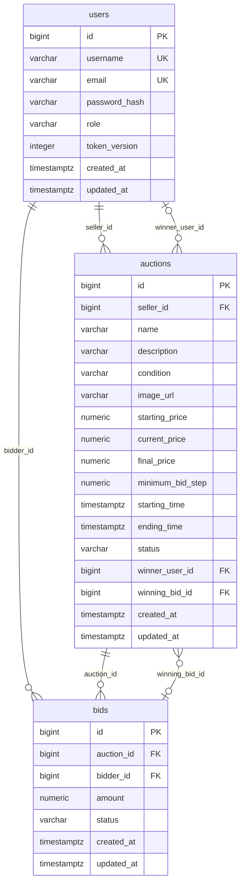

# Database KTPM

## 1. Phạm vi và nguồn

PostgreSQL 16.2; schema do Flyway tạo từ [V1__create_schema.sql](../backend/src/main/resources/db/migration/V1__create_schema.sql). Hibernate dùng `ddl-auto: validate`, không tự tạo/sửa bảng. Có ba bảng nghiệp vụ và bảng kỹ thuật `flyway_schema_history`.

## 2. Sơ đồ quan hệ



Hai quan hệ giữa `auctions` và `bids` có ý nghĩa khác nhau: `bids.auction_id` gắn mỗi bid vào phiên; `auctions.winning_bid_id` trỏ bid đang dẫn đầu hoặc đã thắng. Sơ đồ trên biểu diễn ràng buộc FK thực tế: database chưa có UNIQUE trên `winning_bid_id`, nên riêng FK không giới hạn một bid chỉ được một phiên tham chiếu. Nghiệp vụ quản lý con trỏ này đúng phiên.

## 3. Ý nghĩa và ràng buộc

| Bảng | Trường | Ý nghĩa / ràng buộc |
|---|---|---|
| users | id | BIGINT identity, khóa chính |
| users | username / email | VARCHAR(50)/(254), bắt buộc, duy nhất |
| users | password_hash | VARCHAR(255), BCrypt; không lưu mật khẩu thô |
| users | role | USER hoặc ADMIN |
| users | token_version | Số nguyên ≥ 0; dùng thu hồi JWT |
| auctions | seller_id | Chủ phiên, bắt buộc; FK users |
| auctions | name / description / condition | VARCHAR(200)/(5000)/(50), bắt buộc |
| auctions | image_url | VARCHAR(2000), có thể NULL; một URL ảnh, không có bảng ảnh riêng |
| auctions | starting_price / minimum_bid_step | NUMERIC(19,2), > 0 |
| auctions | current_price | NUMERIC(19,2), ≥ starting_price |
| auctions | final_price | NUMERIC(19,2), có thể NULL; giá kết thúc khi có người thắng |
| auctions | starting_time / ending_time | TIMESTAMPTZ; kết thúc phải sau bắt đầu |
| auctions | status | SCHEDULED, ACTIVE, ENDED, FAILED |
| auctions | winner_user_id / winning_bid_id | Có thể NULL; người và bid dẫn đầu/thắng |
| bids | auction_id / bidder_id | FK bắt buộc tới phiên/người đặt giá |
| bids | amount | NUMERIC(19,2), > 0 |
| bids | status | WINNING, OUTBID, WON, LOST |
| Cả ba | created_at / updated_at | TIMESTAMPTZ bắt buộc; thời gian tạo/cập nhật |

API/nghiệp vụ kiểm tra thêm: ảnh HTTP/HTTPS, nội dung không trống, giá đủ bước, phiên đang nhận bid, người bid không phải chủ phiên hoặc người đang dẫn đầu. CHECK trong SQL không thay thế các luật này. NUMERIC(19,2) tương ứng tối đa 17 chữ số nguyên và 2 số lẻ; backend dùng BigDecimal.

## 4. Index hiện có

| Index | Mục đích |
|---|---|
| users username/email UNIQUE | Chống trùng tài khoản, hỗ trợ tìm đăng nhập |
| bids_one_winning | UNIQUE theo auction_id **chỉ khi status = WINNING**; tối đa một bid dẫn đầu |
| bids_auction (auction_id, id DESC) | Lịch sử bid theo phiên |
| bids_bidder (bidder_id, id DESC) | Bid của người dùng |
| auctions_seller (seller_id, id DESC) | Phiên của chủ phiên |
| auctions_due (status, ending_time, starting_time) | Hỗ trợ truy vấn phiên đến hạn |

Chưa có index UNIQUE riêng cho WON; việc chọn duy nhất bid thắng do nghiệp vụ đảm bảo. Hiệu quả index phải được đo theo truy vấn/workload, không suy ra chỉ từ tên index.

## 5. Xóa và nhất quán

| FK | Khi bản ghi được tham chiếu bị xóa |
|---|---|
| auctions.seller_id → users | CASCADE: xóa các phiên người đó sở hữu |
| bids.auction_id → auctions | CASCADE: xóa bid của phiên |
| bids.bidder_id → users | CASCADE: xóa bid của người đó |
| auctions.winner_user_id → users | SET NULL |
| auctions.winning_bid_id → bids | SET NULL |

Người bán chỉ được xóa phiên của mình chưa có bid. Admin có thể xóa hẳn phiên hoặc tài khoản đã có bid; `AdminService` tính lại giá/người dẫn đầu/kết quả của các phiên còn tồn tại trong transaction. **Xóa trực tiếp bằng SQL không chạy bước tính lại này.**

Đặt bid khóa hàng phiên; bid mới, bid cũ và giá/người dẫn đầu được cập nhật trong cùng transaction. Advisory lock dùng chung cho ghi thông thường và độc quyền khi admin dọn dữ liệu. Xem [kiến trúc backend](KIEN_TRUC_BACKEND.md).

## 6. Lưu trữ và xem dữ liệu

| Cách chạy | DBeaver mặc định | Nơi lưu |
|---|---|---|
| Docker | localhost:5432; DB/user ktpm; mật khẩu ktpm_dev | Volume ktpm_simple_postgres_data, tên thực tế có tiền tố project Compose |
| Portable Windows | localhost:55432; DB/user postgres; mật khẩu trống | backend/.local/postgres |
| Kaggle | PostgreSQL tạm trong runtime notebook | Database mới mỗi trial, dọn sau khi dừng |

`docker compose down` giữ volume; `down -v` xóa volume. Hai database Docker/portable riêng. Có thể đọc bằng DBeaver:

```sql
SELECT id, username, role FROM users ORDER BY id;
SELECT id, name, status, current_price, winner_user_id FROM auctions ORDER BY id;
SELECT id, auction_id, bidder_id, amount, status FROM bids ORDER BY id;
```
