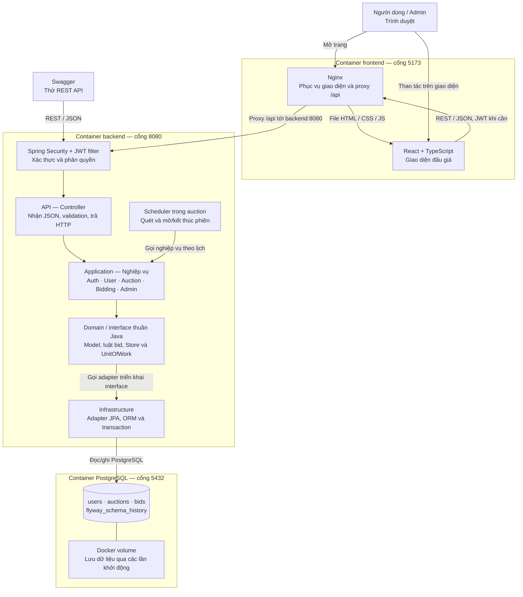

# Kiến trúc tổng quan KTPM

- API gọi nghiệp vụ; nghiệp vụ dùng model và interface, không import framework web/DB. JPA và transaction được triển khai ở infrastructure. `UnitOfWork` nằm trong common.
- JWT filter xử lý xác thực tập trung; endpoint công khai không yêu cầu token, endpoint admin cần quyền ADMIN.
- Scheduler xử lý phiên đến hạn, chờ 5 giây sau mỗi lượt. Giao diện lấy dữ liệu khi thao tác hoặc Làm mới/F5, không có realtime/polling.
- Sơ đồ thể hiện cách chạy Docker. Khi chạy trực tiếp, React dùng Vite proxy, backend và PostgreSQL portable chạy trên host; các tầng backend giữ nguyên.
