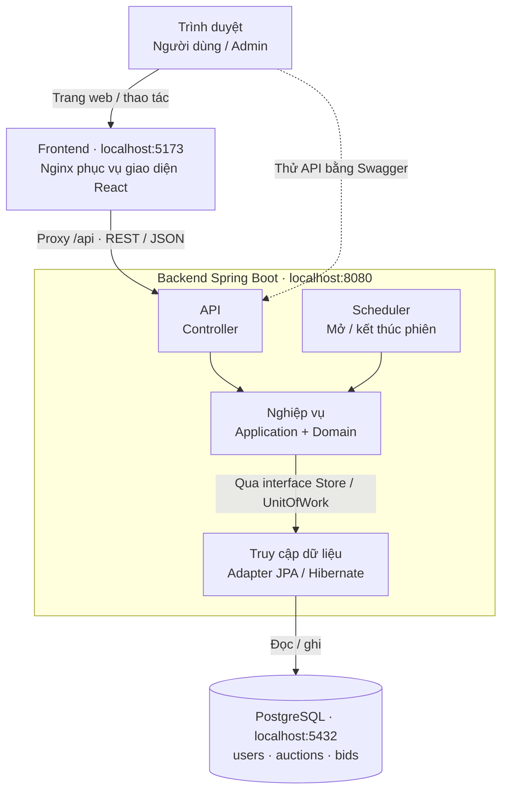

# Kiến trúc tổng quan KTPM

Sơ đồ thể hiện luồng xử lý với ba container Docker và các cổng mặc định. React chạy trong trình duyệt; Nginx phục vụ HTML/CSS/JS và chuyển request `/api` tới backend. Swagger truy cập trực tiếp backend ở cổng 8080.

- **Phân tầng:** API → Nghiệp vụ → Truy cập dữ liệu. Application dùng model/luật và interface trong Domain; nghiệp vụ không import web/JPA. Infrastructure triển khai các interface và transaction. `UnitOfWork` thuộc common.
- **Bảo mật:** Spring Security/JWT filter xác thực trước controller; endpoint công khai không cần token, endpoint admin cần quyền ADMIN. Code security thuộc `auth/infrastructure`.
- **Scheduler:** thuộc `auction/infrastructure`, gọi service nghiệp vụ lúc khởi động và theo lịch; xử lý tuần tự, chờ 5 giây sau mỗi lượt hoàn tất.
- **Dữ liệu:** PostgreSQL lưu bền trong Docker volume; Flyway quản lý migration qua bảng kỹ thuật `flyway_schema_history`.

Khi chạy trực tiếp, Vite thay Nginx để phục vụ frontend/proxy; PostgreSQL portable dùng cổng 55432. Giao diện cập nhật khi thao tác hoặc Làm mới/F5; không có realtime/polling.
