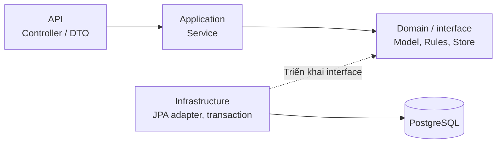

# Kiến trúc backend KTPM

## 1. Cấu trúc

Backend là một ứng dụng Spring Boot, đóng gói một JAR. Source nằm trong [backend/src/main/java/com/ktpm](../backend/src/main/java/com/ktpm). Module theo nghiệp vụ: auth, user, auction, bidding, admin; common chứa các thành phần dùng chung. Mỗi module chỉ có những tầng cần thiết, không bắt buộc đủ mọi thư mục.

| Module | Trách nhiệm chính |
|---|---|
| auth | Register/login/logout, JWT/filter, BCrypt và lấy người dùng hiện tại |
| user | Model/Store tài khoản, kiểm tra tồn tại và DTO danh tính |
| auction | Tạo/xem/xóa phiên, luật đấu giá, vòng đời và scheduler |
| bidding | Ghi bid, lịch sử, bid cá nhân và trạng thái thắng/thua |
| admin | Danh sách tài khoản/phiên, xóa và tính lại kết quả |
| common | BusinessException, Pages, UnitOfWork, mapping, cấu hình và xử lý lỗi |

## 2. Các tầng và phụ thuộc

Mũi tên nét liền API → Application → Domain thể hiện phụ thuộc source; nét đứt thể hiện adapter triển khai interface. Khi chạy, service gọi Store/UnitOfWork và Spring inject adapter thật. Domain không gọi/import JPA; không diễn giải sơ đồ thành Domain phụ thuộc Infrastructure.

| Tầng | Ví dụ | Công việc |
|---|---|---|
| API | AuctionController, AuctionDtos | Mapping HTTP/JSON, Bean Validation, chuyển request thành command |
| Application | AuctionService, BiddingService, AdminService | Điều phối luật, Store và transaction; trả DTO nghiệp vụ |
| Domain | Auction, AuctionRules, AuctionStore, BidStore, UserStore | Model thuần Java, luật và hợp đồng truy cập dữ liệu |
| Infrastructure | JpaAuctionStore, AuctionEntity, AuctionRepository | Mapping entity, Spring Data JPA, khóa, lưu/query |

Application/domain không import Spring Web/JPA/JDBC. `common/infrastructure/ApplicationConfiguration` đăng ký service qua `@Bean`, nên service nghiệp vụ không cần `@Service`. `common/UnitOfWork` là interface; `SpringUnitOfWork` thực thi transaction đọc/ghi/mandatory.

## 3. Request, bảo mật và lỗi

Request qua Spring Security/JWT filter trước Controller. Register/login, Swagger/health và các GET phiên/lịch sử công khai được cấu hình riêng; `/api/admin/**` cần ADMIN, các API còn lại theo SecurityConfig. Controller lấy người dùng hiện tại rồi gọi service, không lặp kiểm tra JWT trong từng endpoint.

BCrypt lưu hash mật khẩu. JWT kiểm tra chữ ký, hạn, tài khoản còn tồn tại và tokenVersion. Logout tăng tokenVersion để vô hiệu token cũ. Tài khoản seed và secret mặc định dành cho chạy thử; cấu hình qua môi trường, không đưa token/secret riêng vào Git.

API validation xử lý kiểu/độ dài/giá đầu vào; luật nghiệp vụ ném BusinessException. ApiExceptionHandler thống nhất JSON lỗi. Xem [đặc tả API](API.md) cho status/schema và endpoint.

## 4. Transaction và đồng thời

Luồng bid trong một transaction ghi:

1. Lấy advisory lock dùng chung cho thao tác đấu giá.
2. Khóa hàng phiên, kiểm tra người dùng/thời gian/quyền/giá.
3. Đổi bid dẫn đầu cũ thành OUTBID, ghi bid mới WINNING.
4. Cập nhật currentPrice/winnerUserId/winningBidId rồi commit.

Khóa hàng phiên serialize ghi trên cùng phiên; phiên khác có thể xử lý đồng thời. Unique index WINNING bổ sung bảo vệ dữ liệu. `MaintenanceLock` dùng `pg_advisory_xact_lock_shared(7312026)` cho ghi thông thường và lock độc quyền cùng key khi admin xóa. Lock theo transaction, giải phóng khi commit/rollback; service truy cập qua interface MaintenanceGate.

Admin xóa user tính lại các phiên còn tồn tại dựa trên bid còn lại. Việc này cùng transaction với xóa; cascade FK và tính lại nghiệp vụ có vai trò khác nhau. Xem [database](DATABASE.md).

## 5. Scheduler

`auction/infrastructure/AuctionScheduler` gọi tick lúc ApplicationReadyEvent và bằng `@Scheduled(fixedDelay...)`, mặc định chờ 5 giây sau lượt hoàn tất. Tick lấy một mốc now, tìm phiên đến hạn rồi duyệt tuần tự; mỗi phiên gọi AuctionLifecycleService trong transaction riêng. Lỗi một phiên được log và thử lại ở lượt tiếp theo.

SCHEDULED được mở khi đến giờ; ACTIVE được đóng khi hết giờ. Phiên có bid thành ENDED, ghi finalPrice và WON/LOST; không có bid thành FAILED. Nếu scheduler chạy muộn vượt cả giờ bắt đầu/kết thúc, một lần advance có thể mở rồi đóng ngay. Bid vẫn kiểm tra endingTime trực tiếp, không chờ scheduler đổi trạng thái mới từ chối bid muộn.

Đây là cơ chế đơn giản cho Pha 1: quét theo lịch, xử lý tuần tự. Kết quả độ trễ và hướng cải tiến nằm trong [báo cáo Kaggle](../reports/kaggle-p1-60e076a7/BAO_CAO_PHA1.md).

## 6. Schema, cấu hình và triển khai

Flyway chạy migration; Hibernate validate schema. `application.yml` khai báo datasource, JWT, CORS, scheduler và Swagger; profile dev bật tài khoản seed. Docker chạy JAR với PostgreSQL ngoài container backend. LocalDemo là launcher phát triển trong source test, chạy PostgreSQL portable, không nằm trong JAR production.

Đọc [cài đặt](CAI_DAT_VA_CHAY.md) để chạy Docker/Windows và [Kaggle](KAGGLE_CPU.md) để đo CPU. Các test backend nằm ở `backend/src/test`, gồm API/nghiệp vụ, đồng thời và kiểm tra phân tầng; frontend kiểm tra riêng. Bộ benchmark đo backend qua REST, không đo rendering frontend.
