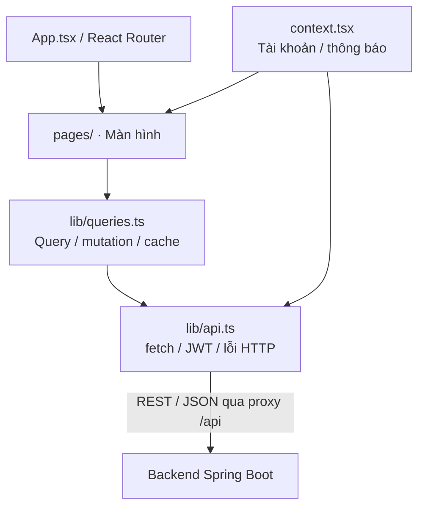

# Kiến trúc frontend KTPM

## 1. Công nghệ và vai trò

Frontend là SPA React 18 + TypeScript, build bằng Vite. React Router điều hướng; TanStack Query quản lý dữ liệu API; decimal.js tính tiền; lossless-json đọc số JSON chính xác; lucide-react cung cấp icon; CSS ở `src/styles.css`. Phiên bản dependency cụ thể nằm trong [package.json](../frontend/package.json) và lockfile.

Frontend hiển thị nghiệp vụ và gọi REST, không kết nối PostgreSQL trực tiếp. Backend quyết định quyền và kết quả bid. Trong Docker, Nginx phục vụ file build; React chạy trong trình duyệt.

## 2. Sơ đồ đơn giản



Các trang dùng thêm `components.tsx`, `types.ts` và `lib/money.ts`. Sơ đồ mô tả luồng frontend, không phải các service triển khai riêng.

## 3. Tổ chức source

| File/thư mục | Trách nhiệm |
|---|---|
| src/main.tsx | Khởi tạo React, QueryClient, BrowserRouter và các Provider |
| src/App.tsx | Khai báo route, ErrorBoundary |
| src/pages/ | Màn hình đăng nhập, danh sách/chi tiết phiên, tạo phiên, hoạt động và admin |
| src/components.tsx | Layout, Guard, trạng thái tải/lỗi/trống và thành phần dùng chung |
| src/context.tsx | AuthProvider, NoticeProvider; nạp danh tính, login/logout, thông báo |
| src/lib/api.ts | Client HTTP dùng chung, Bearer token, parse JSON, ApiError |
| src/lib/queries.ts | useApi/useAction; retry GET, mutation và invalidation |
| src/lib/money.ts | Decimal, kiểm tra/định dạng tiền, so ID, xử lý thời gian |
| src/types.ts | Hợp đồng TypeScript của User/Auction/Bid/Page/Token |
| src/styles.css | Giao diện và responsive cho màn hình nhỏ |
| tests/ / e2e/ | Vitest/Testing Library và Playwright |

## 4. Các route

| Route | Quyền giao diện | Chức năng |
|---|---|---|
| /, /auctions | Công khai | Trang chủ/danh sách, tìm/lọc phiên |
| /auctions/:id | Công khai | Chi tiết/lịch sử; đặt giá khi đăng nhập |
| /login, /register | Công khai | Đăng nhập/đăng ký |
| /activity | Đăng nhập | Bid của mình |
| /selling | Đăng nhập | Phiên của mình |
| /selling/auctions/new | Đăng nhập | Tạo phiên kèm thông tin món hàng |
| /admin, /admin/users, /admin/auctions | ADMIN | Tổng quan, danh sách và xóa dữ liệu |

`Guard` kiểm soát điều hướng và hiển thị; backend vẫn xác thực/phân quyền mọi request cần bảo vệ. Không có màn hình sửa hồ sơ, ví, thanh toán, danh mục, product riêng hay auto-bid. Responsive là giao diện web thích nghi, không phải ứng dụng mobile riêng.

## 5. Xác thực và HTTP

Login gọi `/api/auth/login`, lưu JWT trong `sessionStorage` khóa `ktpm-token`, rồi GET `/api/auth/me`. Khi mở ứng dụng với token có sẵn, AuthProvider nạp lại danh tính. Logout gọi backend và xóa token/danh tính/cache; nếu mất kết nối, UI báo chưa xác nhận thu hồi token phía server.

`api.ts` gắn Authorization theo token hiện tại, hỗ trợ AbortSignal, xử lý 204 không có body. HTTP 401 của token hiện tại phát sự kiện để xóa phiên; kiểm tra token/generation giúp response cũ không ghi đè danh tính mới. 403 là thiếu quyền; 404/409 sau mutation làm mới cache liên quan qua invalidation. Lỗi kết nối/JSON được chuyển thành ApiError để UI hiển thị.

Cache bị xóa khi đổi tài khoản hoặc logout. sessionStorage thuộc phiên tab; token có thể bị sao chép khi trình duyệt nhân bản tab. Backend vẫn là nơi kiểm tra hạn token và tokenVersion.

## 6. Cách cập nhật dữ liệu

Query key là đường dẫn API (gồm query string); staleTime = 10 giây. **staleTime không phải chu kỳ gọi API**. Tắt refetch khi focus cửa sổ và khi reconnect; không cấu hình polling/WebSocket/SSE.

Dữ liệu được lấy khi mở màn hình/query được dùng, chuyển tham số tìm/lọc/phân trang, nhấn Làm mới/F5 hoặc invalidation sau thao tác. Mutation thành công invalidate các query; 404/409 cũng invalidate để cập nhật trạng thái. GET có thể retry một lần với lỗi kết nối/5xx; mutation không tự retry để tránh gửi lặp thao tác ghi.

## 7. Tiền và thời gian

lossless-json giữ số thập phân và số nguyên vượt giới hạn Number an toàn dưới dạng chuỗi; ID/Money có kiểu `string | number`. decimal.js dùng precision 40 để cộng bước giá/so sánh tiền; gửi tiền dưới dạng chuỗi JSON. UI kiểm tra số dương, tối đa 17 chữ số nguyên/2 số lẻ; backend kiểm tra lại.

Thời gian API dùng ISO/UTC. Hiển thị ngày giờ theo `Asia/Ho_Chi_Minh`; input datetime-local được chuyển sang ISO trước khi gửi. Backend quyết định phiên còn nhận bid hay không; đồng hồ giao diện không thay luật server.

## 8. Chạy, build và kiểm tra

```powershell
cd frontend
npm.cmd ci
npm.cmd run dev
npm.cmd run build
npm.cmd test
```

Vite dev cổng 5173, proxy `/api` mặc định tới localhost:8080; chỉnh bằng `BACKEND_PROXY_TARGET`. `VITE_API_BASE_URL` dùng khi client cần base URL khác, được đưa vào bundle lúc build và không dùng để chứa secret. Docker dùng Nginx cổng container 80, ánh xạ host 5173 và proxy tới backend:8080; fallback index.html hỗ trợ tải thẳng route SPA.

Playwright: `npm.cmd run test:e2e`; xem [playwright.config.ts](../frontend/playwright.config.ts) để cấu hình môi trường chạy. Xem [cài đặt](CAI_DAT_VA_CHAY.md), [API](API.md) và [kiến trúc tổng quan](KIEN_TRUC.md).
