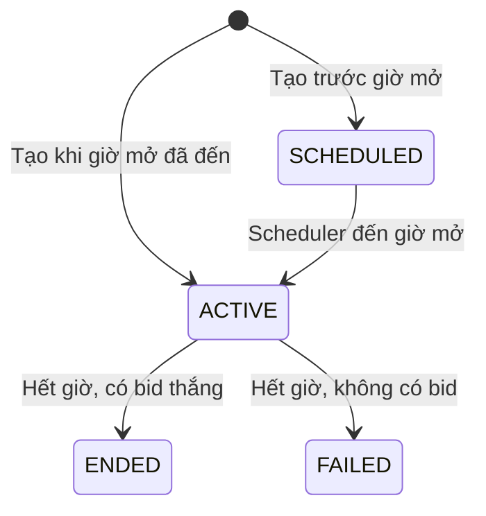
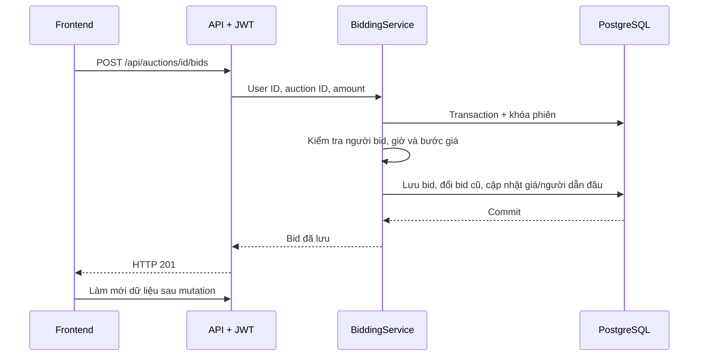

# Luồng nghiệp vụ KTPM

## 1. Vai trò và phạm vi

USER có thể bán và bid; ADMIN quản lý danh sách và xóa dữ liệu. Thông tin món hàng nằm ngay trong phiên, chỉ một URL ảnh tùy chọn. Không có ví/thanh toán/auto-bid/giá dự trữ/danh mục/product riêng, xem/sửa hồ sơ hay khóa/cấm tài khoản.

## 2. Tài khoản

Đăng ký tạo USER với username/email duy nhất và BCrypt hash. Đăng nhập bằng username/email và mật khẩu để lấy JWT; `/api/auth/me` trả danh tính/quyền. Logout thu hồi token qua tokenVersion. ADMIN chỉ xóa tài khoản khác, không được xóa chính tài khoản admin đang thực hiện thao tác.

## 3. Vòng đời phiên

Đây là vòng đời bình thường. Xóa admin loại bỏ bản ghi; khi admin xóa user, ENDED có thể thành FAILED nếu không còn bid hoặc đổi người thắng/giá theo bid còn lại. SCHEDULED chưa nhận bid; ACTIVE chỉ nhận trong khoảng bắt đầu ≤ now < kết thúc. Hết giờ có thể vẫn hiện ACTIVE ngắn do scheduler trễ, nhưng bid bị từ chối ngay theo thời gian server.

## 4. Tạo phiên

Người đăng nhập nhập tên, mô tả, tình trạng, ảnh tùy chọn, giá khởi điểm, bước giá và giờ bắt đầu/kết thúc. Giá/bước > 0, kết thúc sau bắt đầu; API kiểm tra định dạng/độ dài. Giá hiện tại ban đầu bằng giá khởi điểm, chưa có người/bid dẫn đầu. Phiên có thể ACTIVE ngay nếu giờ mở đã đến; trạng thái do backend xác định.

## 5. Đặt giá

Bid đầu ≥ startingPrice; bid tiếp theo ≥ currentPrice + minimumBidStep. Không bid phiên của mình, khi đang dẫn đầu, trước giờ mở hoặc từ giờ kết thúc trở đi. Xung đột nghiệp vụ trả 409; 401/403 là lỗi xác thực/quyền. Khi nhiều request đồng thời, giá hợp lệ được đánh giá sau khi lấy khóa; người dùng phải dựa vào trạng thái mới nhất để thử lại.

Bid mới WINNING, bid trước OUTBID. Khi kết thúc, bid dẫn đầu thành WON, các bid khác LOST; lưu finalPrice và người thắng. Hệ thống chỉ ghi nhận kết quả, không chuyển tiền hay kiểm tra số dư.

## 6. Xem và cập nhật giao diện

Công khai: danh sách/tìm/lọc/phân trang, chi tiết và lịch sử bid. Đăng nhập: xem phiên của mình, bid của mình và tạo/bid. Giao diện cập nhật khi tải trang, đổi query, thao tác hoặc Làm mới/F5; không có tự nhận giá mới từ người dùng khác qua realtime/polling.

## 7. Xóa

| Người thao tác | Được xóa | Kết quả |
|---|---|---|
| Chủ phiên | Phiên của mình chưa có bid | Xóa hẳn phiên |
| ADMIN | Phiên bất kỳ, kể cả đã có bid | Xóa phiên và toàn bộ bid liên quan |
| ADMIN | Tài khoản khác, kể cả đã có bid | Xóa user, phiên họ sở hữu và bid của họ; tính lại các phiên còn tồn tại |

Nếu người bị xóa đang dẫn đầu/thắng ở phiên của người khác: chọn bid cao nhất còn lại. Không còn bid thì currentPrice trở về startingPrice, các con trỏ thắng/finalPrice rỗng; phiên đã kết thúc thành FAILED. Có bid còn lại thì cập nhật đúng người/giá và trạng thái WINNING/WON theo vòng đời phiên.

Xem [API](API.md) cho hợp đồng HTTP, [database](DATABASE.md) cho FK/cascade và [backend](KIEN_TRUC_BACKEND.md) cho transaction/lock.
